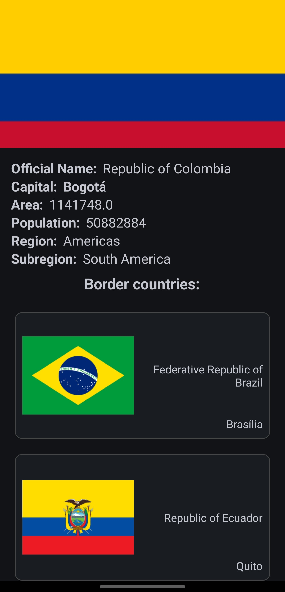

# Requerimientos técnicos para construir el proyecto
desarrollado en: 
- Android Gradle Plugin 8.3.2
- Gradle version 8.4
- JDK 17.0.9

# Capas propuestas
Se desarrolla con una arquitectura Clean y patrón de presentación MVVM:  
<ul>
  <li>Capa de Data: Se responsabiliza de configurar las fuentes de información (API, DDBB, etc) y de los modelos de datos, a demás de los repositorios que hacen uso de dichas fuentes de datos para proveer información.  </li>
  <li>Capa de Domain: Se hace uso de los repositorios para desarrollar la lógica de negocio.  </li>
  <li>Capa de UI: Se desarrolla los ViewModel y las vistas. El viewModel por medio de los casos de uso, obtiene la información solicitada por las vistas y  
envía dicha información por medio de observables a los cuales las vistas están previamente suscritas</li>
</ul>  

# Librerías y tecnologías
<ul>
  <li>Kotlin</li>
  <li>Clean Architecture</li>
  <li>MVVM</li>
  <li>Inyección de dependencias con Dagger Hilt</li>
  <li>Bases de datos con Room</li>
  <li>Corrutinas</li>
  <li>LiveData</li>
  <li>Recycler View</li>
  <li>Navigation Component</li>
  <li>Consumo de API con corrutinas</li>
  <li>Unit testing con Junit y Mockk</li>
  <li>Shimmer View</li>
  <li>ViewBinding</li>
  <li>Model Mappers usando funciones de extensión</li>
  <li>Casos de uso</li>
  <li>Repositorio</li>
  <li>Genéricos</li>
  <li>Sealed Classes</li>
</ul>

# ScreenShots
  
  
  
